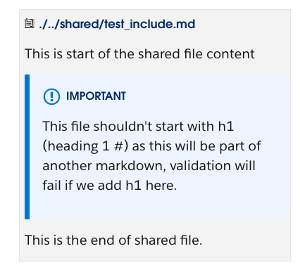

# SalesforceDocs Markdown Preview


SalesforceDocs Markdown Preview is a [Micromark-compliant](https://github.com/micromark/micromark) VS Code extension for Markdown previews. By default, the exrension uses Salesforce docs look-and-feel for previews. It features [most of the out-of-the-box Markdown preview features](https://code.visualstudio.com/docs/languages/markdown) like:

- Dynamic previews
- Editor and preview synchronization
- Custom CSS

<!-- ## Prerequisites

Before you use the plugin, disable the default markdown-language-feature extension of VS Code by following these steps:


1. Click on the **Extension** icon in the Activity Bar on the side of VS Code or use the **View: Extensions** command (⇧⌘X).
2. In the extension filter, type and select **@builtin**.
3. Scroll down and select **Markdown Language Features**
4. Click the **Disable** button.
5. Click the **Reload Required** button to reload VS Code. -->

## Keybindings

> The `cmd` key for *Windows* is `ctrl`.

| Shortcuts               | Functionality                                       |
| ----------------------- | --------------------------------------------------- |
| `cmd-k f` or `ctrl-k f` | Open SalesforceDocs Preview in full screen mode     |
| `cmd-k s` or `ctrl-k s` | Open SalesforceDocs Preview in the side editor mode |

## Configurations

The SalesforceDocs Markdown Preview offers most configuration options that are provided by the default Markdown preview of Visual Studio Code. In addition to that, you can also select your style preset to match SalesforceDocs, or the default Visual Studio Code preview, in the **Settings**.

## Markdown Support

The extension supports all CommonMark syntax and the following additional plugins:

### Content Re-use

```md
::include{src="./../shared/test_include.md"}
```

Renders to



### Pull code samples from multiple sources

#### 1. File in the same repository

````mdx
```sfdocs-code {"lang":"java", "title": "From the same repo", "src": "./../../../samples/quip-java/test.java" }

```
````
#### 2. File from a public Gist on GitHub

````mdx
```sfdocs-code {"lang":"markdown", "title": "From a GitHub Gist file", "src": "https://gist.githubusercontent.com/sejal-salesforce/6dfe506915cb0f6b2295d3fd6f8c9fe1/raw/0b681d9617c0b8bba56e42d3b63b816f6c155337/sample-gist.md" }

```
````

To get the URL of the file in GitHub Gist, click **Raw** button and copy the URL from your browser's address bar.

#### 3. File from a public GitHub repository

````mdx
```sfdocs-code {"lang":"javascript", "title": "From lwc-recipes GitHub Repository", "src": "https://raw.githubusercontent.com/trailheadapps/lwc-recipes/master/force-app/main/default/lwc/clock/clock.js" }

```
````

> You must use the raw URL for the file in the GitHub Repo. To get this URL, click **Raw** on the file in GitHub.

### Callouts

Use the following different callouts in your Markdown:

```md
:::tip
An example of a tip
:::

:::warning
An example of a warning
:::

:::caution
An example of a caution
:::

:::note
An example of a note
:::
```

### Videos

Add videos from youtube to your content using

```m
::video{src="https://youtube.com/embed/di6iwHhrH6s" title="Video from Youtube" type="youtube" }
```

